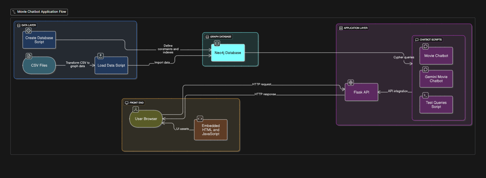

# Movie Database Chatbot

A simple and interactive web application that lets you chat with a movie database stored in Neo4j using AI language models (Deepseek and Google Gemini).

## WorkFlow



## Features

- Query movies, actors, directors, and relationships using natural language.
- Supports two AI models: **Deepseek** and **Google Gemini**.
- Flask-based web interface with a responsive chat UI.
- Scripts to create and load data into Neo4j.

## Prerequisites

Before you begin, ensure you have the following installed on your system:

- Python 3.10 or higher
- Neo4j (local installation or cloud instance)
- `powershell.exe` (Windows default shell) or a compatible terminal

## Setup Instructions

Follow these steps to get the project running locally:

1. **Clone the repository**

   ```powershell
   git clone https://github.com/Gyana491/neo4j-movie-chatbot.git
   cd neo4j-movie-chatbot
   ```
2. **Create and activate a virtual environment**

   ```powershell
   python -m venv venv
   .\venv\Scripts\Activate
   ```
3. **Install project dependencies**

   ```powershell
   pip install --upgrade pip
   pip install -r requirements.txt
   ```
4. **Configure environment variables**

   - Copy the example file (if provided) or create a new `.env` in `config/`:
     ```powershell
     copy config\.env.example config\.env
     ```
   - Open `config/.env` and set the following values:
     ```dotenv
     NEO4J_URI=bolt://localhost:7687
     NEO4J_USER=neo4j
     NEO4J_PASSWORD=your_password
     OPENAI_API_KEY=your_openai_key
     GEMINI_API_KEY=your_gemini_key
     ```
5. **Create and load data into Neo4j**

   ```powershell
   python scripts/create_database.py
   python scripts/load_data.py
   ```
6. **Run the Flask application**

   ```powershell
   python app.py
   ```

   - The app will be available at **http://localhost:8080/**

## Project Structure

```
app.py                 # Flask web server
config/                # Environment variable files
  .env                 # Your configuration (ignore for git)
data/                  # CSV data files for movies, people, relationships
scripts/               # Helper scripts
  create_database.py   # Creates Neo4j database/schema
  load_data.py         # Loads CSV data into Neo4j
  chatbot.py           # Deepseek-based chatbot implementation
  gemini_chatbot.py    # Google Gemini-based chatbot implementation
  test_queries.py      # Script for testing sample queries
requirements.txt       # Python dependencies
readme.md              # This file
```

## Usage

- Open the chat interface in your browser.
- Select the AI model (`Deepseek` or `Gemini`).
- Type your question (e.g., "Find movies directed by Christopher Nolan").
- Press **Enter** or click **Send** to get results.
